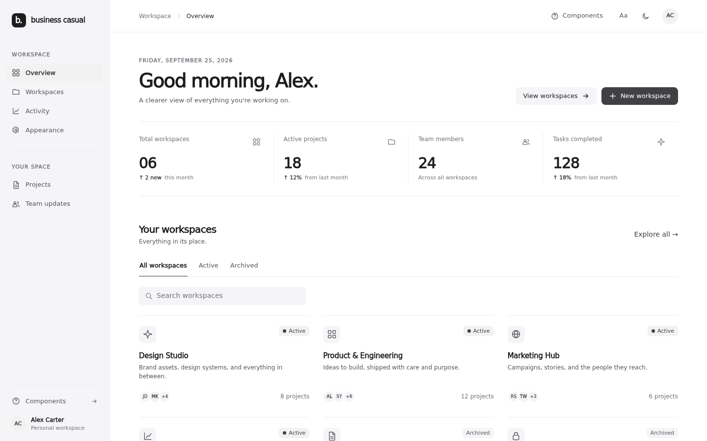
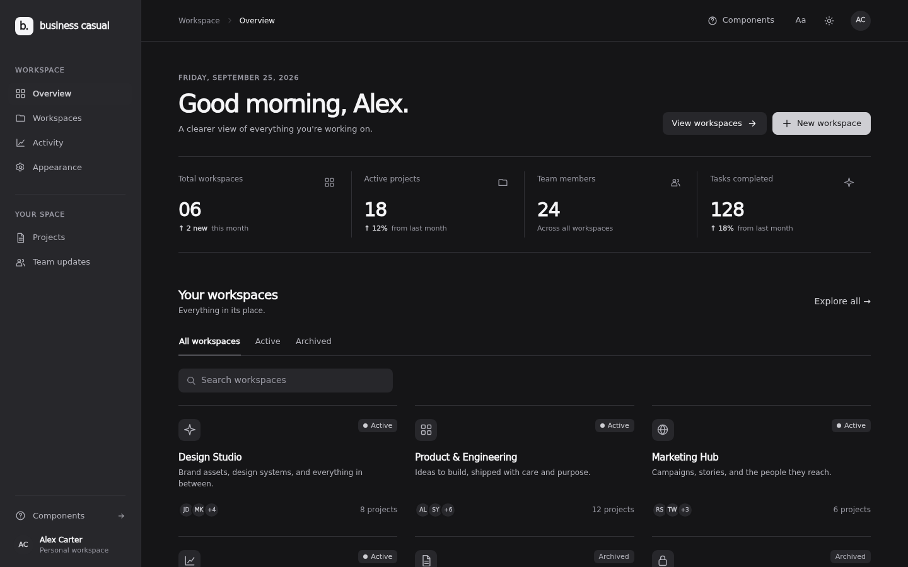
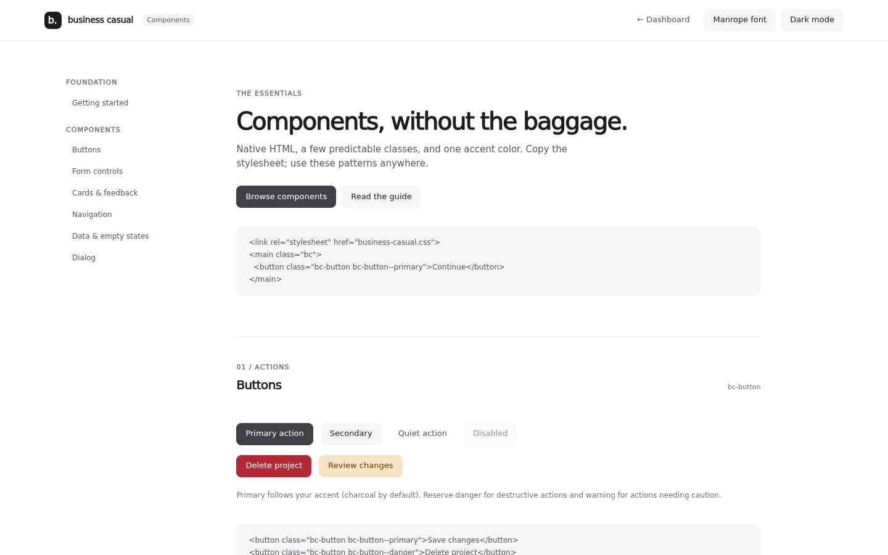

# Business Casual

A quiet, monochrome interface theme with one configurable accent color, automatic dark mode, and no dependencies. Inspired by the restrained spacing and hierarchy of modern business software; not affiliated with Apple.

## Screenshots

| Dashboard · light | Dashboard · dark |
| --- | --- |
|  |  |



## Use in another project

Copy **`styles/business-casual.css`** into your project and load it after your base styles. The other files are only for the dashboard and component-gallery demos.

```html
<link rel="stylesheet" href="business-casual.css">
<div class="bc">
  <article class="bc-card" style="padding: 24px">
    <h2 class="bc-h2">A calmer workspace</h2>
    <p class="bc-muted">Everything in its place.</p>
    <button class="bc-button bc-button--primary">Get started</button>
  </article>
</div>
```

Put `.bc` on the root of the interface (including `<body>` if you want the whole page themed). Component selectors are prefixed with `bc-` so they can coexist with an existing application. The theme sets `box-sizing` and basic typography **inside** `.bc`; it does not install a global reset. No fonts, icons, scripts, or network requests are required by the stylesheet.

### Install from npm

```sh
npm install business-casual-theme
```

With a bundler that supports CSS imports:

```js
import 'business-casual-theme/business-casual.css';
// Optional: import 'business-casual-theme/business-casual-manrope.css';
// Optional: import 'business-casual-theme/business-casual-table.js';
```

The published package includes the optional local Manrope font and its license. If your project uses plain HTML without a bundler, copy the appropriate files from `node_modules/business-casual-theme/dist/` and keep `fonts/` next to `business-casual-manrope.css`.

## Color and appearance

The default accent is charcoal, so primary buttons are neutral by default. **Primary follows `--bc-accent`** if you choose another color (including blue). Set it on the `.bc` root; for a separate dark-mode shade, override it on both selectors:

```css
.bc { --bc-accent: #7958ce; }
.bc[data-theme="dark"] { --bc-accent: #b49cff; }
@media (prefers-color-scheme: dark) {
  .bc:not([data-theme]) { --bc-accent: #b49cff; }
}
```

With no `data-theme` attribute, the theme follows `prefers-color-scheme`. Set `data-theme="light"` or `data-theme="dark"` on `.bc` to force an appearance. Change the attribute at runtime to toggle it. Explicit light mode uses the default light palette regardless of the system preference. The demo saves your choices in local storage; the CSS itself requires no JavaScript.

### Optional second font

The default uses the device's system font. For a distinct, modern sans-serif, copy `styles/business-casual-manrope.css`, `assets/manrope-latin-wght-normal.woff2`, and `assets/MANROPE-LICENSE.txt` alongside the main stylesheet, preserving the relative paths. Load the optional CSS after the theme and set `data-font="manrope"` on the `.bc` root:

```html
<link rel="stylesheet" href="styles/business-casual.css">
<link rel="stylesheet" href="styles/business-casual-manrope.css">
<main class="bc" data-font="manrope">...</main>
```

Remove `data-font` to return to the system font. Manrope is bundled locally under the SIL Open Font License; neither option needs a font CDN. The dashboard and component gallery include a font switcher and remember the choice in the browser. You can also supply your own stack through `--bc-font` without loading the optional file.

Semantic tokens available for further customization: `--bc-page`, `--bc-surface`, `--bc-surface-muted`, `--bc-surface-hover`, `--bc-text`, `--bc-text-secondary`, `--bc-text-tertiary`, `--bc-border`, `--bc-border-strong`, `--bc-shadow`, `--bc-radius-sm`, `--bc-radius`, `--bc-radius-lg`, and `--bc-font`. Derived accent tokens include `--bc-accent-hover`, `--bc-accent-soft`, and `--bc-accent-border`. Primary button tokens `--bc-primary` and `--bc-primary-hover` follow the accent unless overridden; `--bc-primary-contrast` sets their label color. Danger and warning have separate `--bc-danger-*` and `--bc-warning-*` tokens as deliberate semantic exceptions to the otherwise monochrome/single-accent palette. Dark mode overrides its palette, so customize the dark selector too if needed.

## Included building blocks

| Element | Classes / attributes |
| --- | --- |
| Typography | `bc-h1`, `bc-h2`, `bc-h3`, `bc-muted`, `bc-caption`, `bc-eyebrow`, `bc-link` |
| Buttons | `bc-button`, `bc-button--primary`, `bc-button--danger`, `bc-button--warning`, `bc-button--quiet`, `bc-button--icon` |
| Forms | `bc-input`, `bc-select`, `bc-textarea`, `bc-field`, `bc-label`, `bc-hint`, `bc-search`, `bc-check`, `bc-switch`, `bc-switch-track` |
| Surfaces | `bc-card`, `bc-card--flat`, `bc-divider` |
| Indicators | `bc-badge`, `bc-badge--accent`, `bc-dot`, `bc-avatar`, `bc-avatar--accent` |
| Navigation | `bc-nav-item` with `aria-current="page"`; `bc-tabs` and `bc-tab` with `aria-selected="true"`; `bc-segmented` with `aria-pressed="true"` |
| Feedback | `bc-alert`, `bc-alert--accent`, `bc-alert-icon`, `bc-alert-title`, `bc-empty` |
| Data | `bc-table-toolbar`, `bc-table-wrap`, `bc-table`, `bc-table-sort`, `bc-table-reorder`, `bc-table-empty` |
| Overlay | `bc-dialog`, `bc-dialog-header`, `bc-dialog-actions` |

### Copyable patterns

```html
<label class="bc-field">
  <span class="bc-label">Email</span>
  <input class="bc-input" type="email" required>
  <span class="bc-hint">We'll only use this to contact you.</span>
</label>

<label class="bc-switch">
  <input type="checkbox" checked>
  <span class="bc-switch-track" aria-hidden="true"></span>
  Email notifications
</label>

<div class="bc-alert bc-alert--accent" role="status">
  <div><strong class="bc-alert-title">Saved</strong><p>Your changes are ready.</p></div>
</div>
```

For tables, wrap a semantic `<table class="bc-table">` in `<div class="bc-table-wrap">` and use `<th scope="col">` headings. For overlays, use a native `<dialog class="bc-dialog">` and call `showModal()` from your application. Tabs and segmented controls have styling for their selected states, but your application must update `aria-selected` / `aria-pressed`, associated panels, and keyboard behavior; see `components.js` for a small working example. Use real links for navigation and real buttons for actions.

### Optional client-side table search, sorting, and column rearranging

Copy **`scripts/business-casual-table.js`** alongside the stylesheet and include it with `defer` if you want search, sortable columns, and rearrangeable columns. This small, dependency-free script automatically enhances each `data-bc-table` table. It operates on rows already in the DOM; it does not fetch data, paginate, or require a framework.

```html
<script src="business-casual-table.js" defer></script>

<div class="bc-table-toolbar">
  <label class="bc-search">
    <input class="bc-input" type="search" aria-label="Search projects"
           data-bc-table-search="projects">
  </label>
  <span class="bc-caption" data-bc-table-count="projects" aria-live="polite"></span>
</div>
<div class="bc-table-wrap">
  <table class="bc-table" id="projects" data-bc-table>
    <thead><tr>
      <th scope="col"><button class="bc-table-sort" type="button">Project</button></th>
      <th scope="col" data-bc-sort-type="date">
        <button class="bc-table-sort" type="button">Updated</button>
      </th>
    </tr></thead>
    <tbody>
      <tr><td>Brand guidelines</td><td data-sort-value="2026-09-25">Today</td></tr>
      <tr data-bc-table-empty class="bc-table-empty" hidden>
        <td colspan="2">No matching projects.</td>
      </tr>
    </tbody>
  </table>
</div>
```

Search matches visible text across each row, case-insensitively; sorting works on the full client-side set and stays active while filtering. Click a heading again to reverse its order. `aria-sort` is updated on the active heading. Text sorting is locale-aware and numeric-friendly; add `data-bc-sort-type="number"` or `"date"` to a `<th>` for typed comparisons. Use `data-sort-value` on a cell for a machine-readable value when the displayed text is formatted (ISO dates are recommended).

The script adds a small **drag handle** to each column heading. Drag one handle onto another column to move its heading and every cell together; for keyboard use, focus a handle and press **Left** or **Right**. A screen-reader status announces the new position. Active sort and search remain in effect when columns move. The order is local to the current page; persist it in your application if needed. The controller also exposes `BusinessCasualTable.init(table).moveColumn(fromIndex, toIndex)` for programmatic moves.

Search and count controls bind to the table's unique `id`, so multiple tables can coexist. For rows added after initialization, call `BusinessCasualTable.init(table).refresh()`; calling `init` again is safe and returns the existing controller. The enhancement assumes a single header row, one `<tbody>`, and no merged data cells. Without the script, the table remains readable and styled, but the search input and sorting buttons will not function; omit those controls when using CSS alone.

The theme includes keyboard focus styles and reduced-motion support. App-specific layouts, icons, validation, and interactive behavior are intentionally separate. No JavaScript is necessary for the visual styling.

## Preview

Open `components.html` for a browsable gallery of copyable component patterns, or `index.html` for the responsive dashboard. The dashboard lets you switch light/dark/system appearance, change the accent, search and filter workspaces, and add a workspace for the current page session. Its newly created workspaces are not persisted. Both example pages use page-specific CSS and JavaScript; **only `styles/business-casual.css` is needed to reuse the kit.**

## Build and release

Run `npm ci`, `npm test`, and `npm run build` to create `dist/`. The build copies the production CSS and optional table script, and rewrites the Manrope font URL so the published CSS finds the bundled `dist/fonts/` file. `npm pack --dry-run` previews the exact package contents; `prepack` rebuilds before publishing. The dashboard/gallery files are not part of the npm package.

GitHub Actions runs tests and builds on pull requests and pushes to `main`. Pushing a tag matching `v` + `package.json` version runs `.github/workflows/release.yml`, which tests, builds, publishes to npm with provenance, and creates a GitHub Release with the distribution archive. For example, after a reviewed version bump and commit, push `v0.2.0` for a package with version `0.2.0`. Do not reuse a version that is already published on npm.

**First publication requires npm setup:** sign in to an npm account with permission to publish `business-casual-theme`, run `npm publish --access public` once for the initial version, then configure an npm **Trusted Publisher** for GitHub Actions in the package settings: owner `Joseda-hg`, repository `business-casual-theme`, workflow file `release.yml`, permission to publish. After that, pushing `v0.1.0` creates the first GitHub Release without trying to republish the already existing npm version. Subsequent new-version tags use GitHub OIDC; no long-lived npm token is stored in GitHub. The package name must still be available when first published.

The theme source is MIT licensed (`LICENSE`). The bundled Manrope font has its own SIL Open Font License (`assets/MANROPE-LICENSE.txt`).
